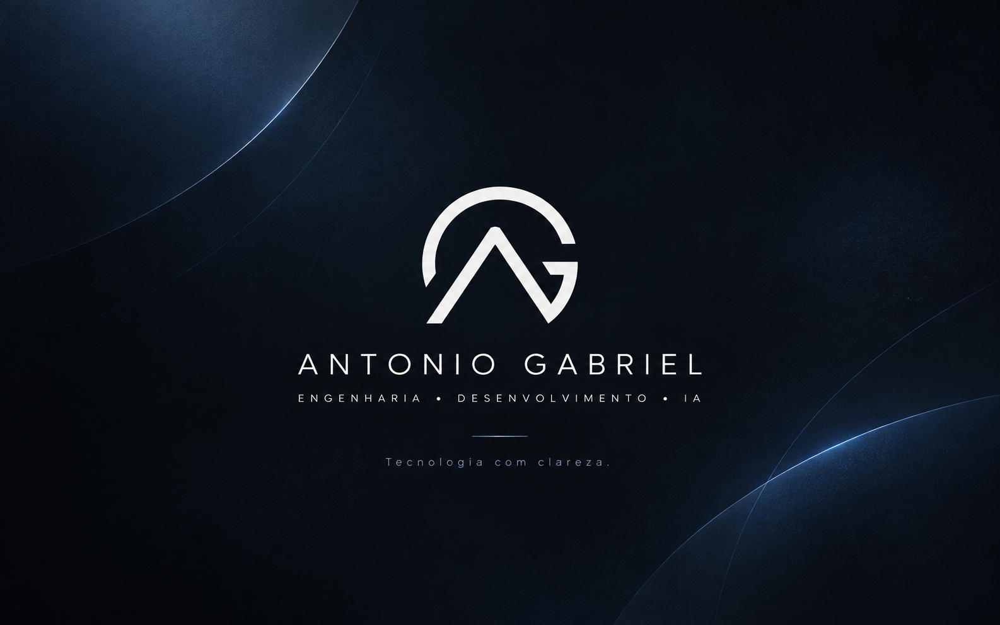

  

  <strong>Backend Developer & AI Engineer · LizardTI</strong> 
  <a href="https://www.linkedin.com/in/antonio-gabriel-b51177162">LinkedIn</a> ·
  <a href="mailto:antonio.gabrielTI@outlook.com">Email</a>

## About

I build backend systems, AI agents, and WhatsApp automations for real businesses. My work connects LLMs to enterprise data through APIs and MCP, with a focus on reliable production systems.

4+ years of experience · João Pessoa, Brazil · Open to remote collaborations.

## Stack

- **Backend:** Python, FastAPI, PostgreSQL, Redis.
- **AI:** LangGraph, LangChain, FastMCP, Anthropic SDK, Unsloth / LoRA.
- **Automation & infrastructure:** n8n, Evolution API, Docker, Linux, Traefik.

## Selected work

- **Farmácia Ativa AI** — WhatsApp agent for real-time order, customer, and delivery queries through MCP.
- **Disupra IA** — Distributor assistant with 12 specialized MCP tools connected to business data.
- **n8n Dispatch** — Dual-channel WhatsApp automation with retries and branch-aware scheduling.
- **Text-to-SQL Winthor** — Qwen fine-tuning for natural-language queries over an Oracle / TOTVS schema.

  
Education

- **Generative AI specialization** — UNICORP Faculdades, 2026.
- **Systems Analysis and Development** — UNIPÊ, 2025.
- **Computer Science** — UNIPÊ, 2022.

